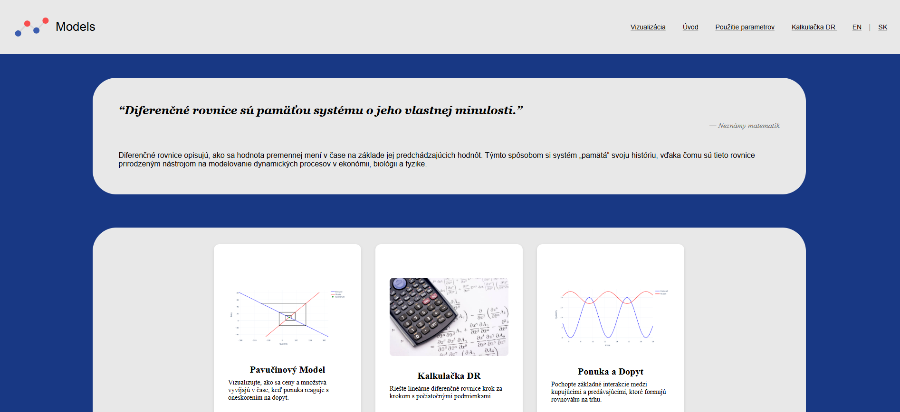
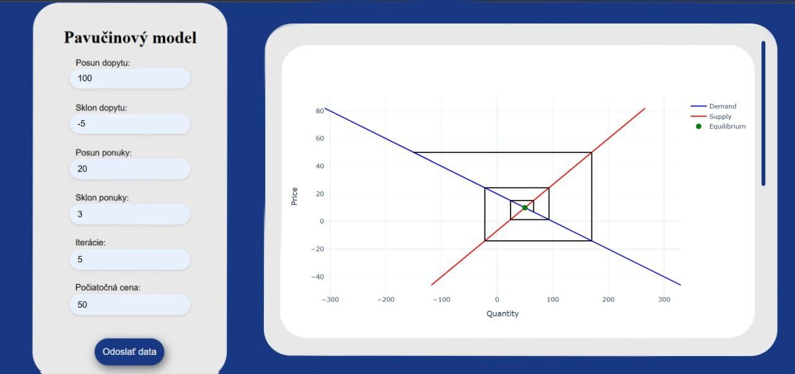
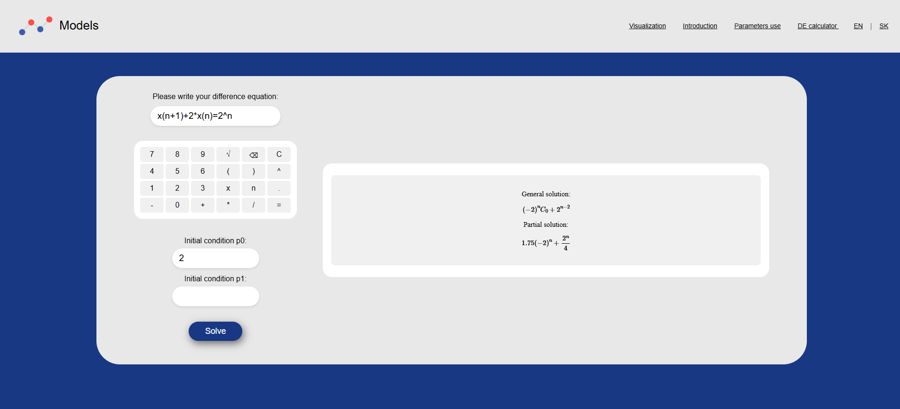

# Cobweb Website - Difference Equations & Economic Models

A modern web application for visualizing and understanding **difference equations** and **economic models**, with a focus on interactive demonstrations of dynamic systems.

## 🎯 Overview

This project is an educational web application designed to help students and economists understand complex dynamic systems through interactive visualizations. It covers fundamental concepts in difference equations and their applications to economic models like the **Cobweb Model**, supply-demand dynamics, and price-quantity relationships.

The application provides:
- **Interactive Calculator** for solving difference equations
- **Visual Models** with real-time parameter adjustments
- **Multi-language Support** (English, Slovak)
- **Mathematical Rendering** with LaTeX and Plotly charts


---

## ✨ Features

### 1. **Cobweb Model**
Interactive visualization of how price and quantity reach equilibrium through cyclical adjustments.



**Variations include:**
- Convergence to equilibrium
- Divergence from equilibrium
- Oscillatory behavior
- Chaotic dynamics

### 2. **Difference Equations Calculator**
Solve difference equations with automatic LaTeX rendering of solutions.



### 3. **Supply & Demand Analysis**
Explore how market equilibrium is determined through supply and demand curves.

### 4. **Normal Price Model**
Analysis of long-run equilibrium in dynamic economic systems.

### 5. **Adaptive Expectations**
Study how expectations adapt over time in economic forecasting.

### 6. **Chaos & Anomalies**
Explore chaotic behavior and system anomalies in difference equations.

### 7. **Multi-language Support**
Full support for English and Slovak languages with dynamic language switching.

---

## 📁 Project Structure

```
cobweb-website/
├── app.py                          # Flask application entry point
├── Dockerfile                      # Docker configuration
├── requirements.txt                # Python dependencies
├── secret.env                      # Environment variables
│
├── api/                            # API route handlers
│   ├── __init__.py
│   ├── home_api.py                 # Home page routing
│   ├── calculator_api.py           # Calculator endpoints
│   ├── models_api.py               # Model visualization endpoints
│   ├── intros_and_params_api.py   # Introduction & parameters
│   └── language_api.py             # Language switching
│
├── dictionaries/                   # Content dictionaries
│   ├── intros_dictionary.py
│   ├── models_dictionary.py
│   └── params_dictionary.py
│
├── tools/                          # Calculation & modeling tools
│   ├── diff_calculator.py          # Difference equation solver
│   └── models/
│       ├── cobweb_equations.py
│       ├── cobweb_functions.py
│       ├── demand_and_supply.py
│       ├── adaptive_expectations.py
│       ├── normal_price.py
│       └── prices_periods_dependency.py
│
├── static/                         # Static assets
│   ├── css/                        # Stylesheets
│   │   ├── global.css
│   │   ├── index.css
│   │   ├── calculator.css
│   │   ├── data.css
│   │   ├── intros.css
│   │   └── params.css
│   ├── js/                         # JavaScript files
│   │   ├── data.js
│   │   └── intro.js
│   └── img/                        # Images & diagrams
│
├── templates/                      # HTML templates
│   ├── base.html                   # Base template
│   ├── index.html                  # Home page
│   ├── calculator.html             # Calculator interface
│   ├── data.html                   # Data visualization
│   ├── intros_base.html
│   ├── params_base.html
│   └── partials/                   # Reusable template components
│       ├── math_table.html
│       └── math_table_calc.html
│
└── utils/                          # Utility functions
    ├── checking_utils.py
    └── solutions_utils.py
```

---

## 🚀 Installation

### Prerequisites
- Python 3.8+
- pip or conda

### Local Setup

1. **Clone the repository**
   ```bash
   git clone <repository-url>
   cd cobweb-website
   ```

2. **Create a virtual environment**
   ```bash
   python -m venv venv
   source venv/bin/activate  # On Windows: venv\Scripts\activate
   ```

3. **Install dependencies**
   ```bash
   pip install -r requirements.txt
   ```

4. **Set environment variables**
   ```bash
   # Create a .env file or use secret.env
   export SECRET_KEY="your-secret-key-here"
   ```

5. **Run the application**
   ```bash
   python app.py
   ```

The application will be available at `http://localhost:5000`

---

## 📖 Usage

### Home Page
Navigate to `/` to access the main menu with all available models and tools.

### Cobweb Model
Access the interactive cobweb model at `/model/cobweb` to adjust parameters and visualize model behavior.

### Calculator
Use the difference equations calculator at `/calculator` to solve equations and see LaTeX-formatted solutions.

### Data Visualization
View interactive charts and data analysis at `/data`.

### Language Switching
Switch between English and Slovak from the language menu in the navigation bar.

---

## 🛠️ Technologies

| Technology | Purpose |
|-----------|---------|
| **Flask** | Web framework for routing and templating |
| **SymPy** | Symbolic mathematics & equation solving |
| **Plotly** | Interactive data visualization |
| **NumPy** | Numerical computations |
| **HTML5/CSS3** | Frontend structure and styling |
| **JavaScript** | Client-side interactivity |

### Dependencies
- flask ~3.0.3
- sympy ~1.13.2
- plotly ~5.24.1
- numpy ~1.26.4

---

## 🧮 Models & Tools

### Difference Equations Calculator
Solves linear and non-linear difference equations, providing:
- General solutions
- Particular solutions
- LaTeX mathematical notation rendering

### Cobweb Model
Demonstrates supply-demand dynamics with:
- Convergent equilibrium
- Divergent patterns
- Oscillatory cycles
- Chaotic behavior

**Key Equations:**
- Demand: $P_d = a - b \cdot Q_d$
- Supply (lagged): $Q_s = c + d \cdot P_{t-1}$
- Equilibrium condition: $Q_d = Q_s$

### Normal Price Model
Analyzes long-run equilibrium behavior and convergence properties.

### Adaptive Expectations
Models how agents form expectations adaptively based on past errors.

### Supply & Demand Analysis
Comprehensive visualization of:
- Market equilibrium
- Consumer and producer surplus
- Elasticity effects

---

## 🔌 API Endpoints

| Endpoint | Method | Description |
|----------|--------|-------------|
| `/` | GET | Home page |
| `/calculator` | GET | Calculator interface |
| `/calculator` | POST | Calculate difference equations |
| `/model/<model_name>` | GET | Display specific model |
| `/data` | GET | Data visualization page |
| `/intros/<section>` | GET | Introduction pages |
| `/params/<model>` | GET | Model parameters page |
| `/language` | POST | Switch language |

---

## 🐳 Docker Deployment

### Build Docker Image
```bash
docker build -t cobweb-website .
```

### Run Container
```bash
docker run -p 5000:5000 \
  -e SECRET_KEY="your-secret-key" \
  cobweb-website
```

The application will be accessible at `http://localhost:5000`

---

## 👨‍💼 About

This educational application was developed as a **Bachelor's thesis project** in Computer Modeling. It demonstrates the practical application of computational techniques, symbolic mathematics, and interactive visualization to make complex economic and mathematical concepts accessible through hands-on experimentation.

---
